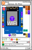

# Description
Usini Cards est un jeu de carte gratuit et libre (licence CC-By) pour apprendre à relier des composants électroniques entre eux.   

Son but est d'être une ressource éducative basique à distribuer dans les fablabs.
* [Télécharger les cartes](https://github.com/usini/usini-cards/archive/master.zip)
* [Twitter - @m4dnerd](https://twitter.com/m4dnerd) 

# Explications
## Imprimer les cartes
A l'aide du logiciel inkscape, ouvrez ces fichiers puis imprimer les.
* boards_1_fr.svg
* sensors_1_fr.svg
* sensors_2_fr.svg
* sensors_3_fr.svg

## Utilisation

[Mode d'emploi (pdf)](https://github.com/usini/usini-cards/blob/master/usini_manual_fr.pdf)

### Informations
Voici les informations disponibles sur les cartes:
* Type
* Connexions possible (SPI/I2C/Digital/Analogique)
* Tension
* Bibliothèque Arduino / Exemple de test
* Consommation électrique (en ma)
* Prix (constaté par le créateur de la carte)

# Cartes disponibles
Les cartes sont triés par catégories de composants.

 Base (Boards): La base du circuit électronique, une puce programmable (le plus souvent par USB) pour contrôler d'autres composants.    

 Capteurs (Sensors): Tout ce qui capte le réel 

*  : Température
*  : Température et humidité
*  : Luminosité
*  : Barométre
*  : Ouverture/Fermeture porte et genètre
*  : Accéléromètre / Gyroscope / Magnétomètre
*  : Présence / Niveau d'eau
*  : Poids

# Cartes à faire
 Contrôles (controls):  Contrôler sa base à l'aide par ex de boutons / potards / lecteur de cartes etc...

 Affichage (displays): Afficher (ex:écrans) ou notifier (ex:leds/buzzer/haut parleurs)

 Communication (communication) : Communiquer à distance ou par câble (ex: radio RFM95 / infrarouge)

 Stockage (storage): Stocker des informations (ex: lecteur carte SD)

 Alimentation (powersupply) : Alimenter (ex:batterie) ou changer la tension d'un circuit (ex: Boost 1v -> 3.3v)

# Diagrammes
Chaque carte ont été faites à l'aide de diagrammes et d'icones qui sont dans le domaine publique.   
Elles sont disponibles le dossiers [diagrams](https://github.com/usini/usini-cards/tree/master/diagrams)

[Voir tout les diagrammes](https://github.com/usini/usini-cards/blob/master/all.svg)

# Contribuer

## Fabriquer ses cartes
Pour créer ou modifier des cartes, ils vous suffit d'avoir le logiciel inkscape.

Voici une vidéo en accéléré où je reproduis un DAC audio sous inkscape
[--> Youtube](https://www.youtube.com/watch?v=op52NjuFaWk)

J'essaye de faire que le composant soit reconnaissable en évitant de créer trop de formes.
Pour cela j'utilise en priorité les formes les plus simples (rectangle / cercle / texte).

## Proposer des cartes
Si vous avez des idées de composants à ajouter, ou des améliorations à proposer, vous pouvez demander de nouvelles cartes sur :
* Github Issues : https://github.com/usini/usini-cards/issues
* Twitter : https://twitter.com/m4dnerd

# Contributeurs
* Cartes RESA - [Rémi Sarrailh](https://twitter.com/m4dnerd) 
* Diagrammes - [Rémi Sarrailh](https://twitter.com/m4dnerd) 